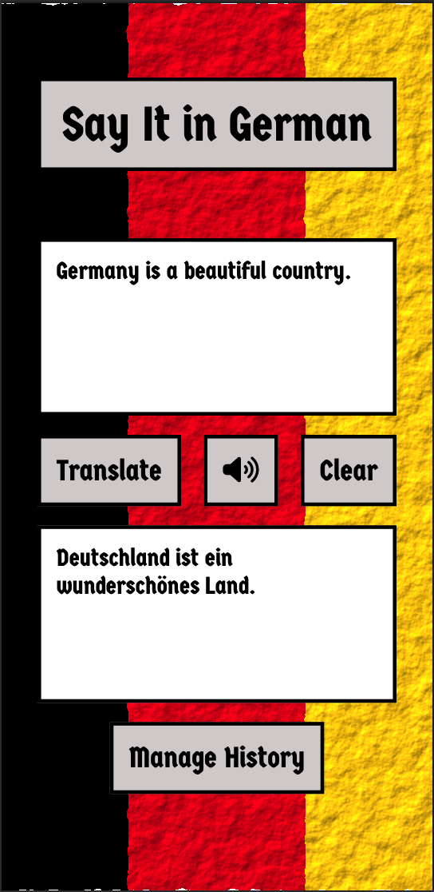

# Say It in German!
A translation app that takes in English text and translates it to German, with the option of speaking it as well. It is built with React, Node.js, Express, Firebase Database, and powered by OpenAI and Eleven Labs for TTS. 

## In This Document:
- [Live Application URL](#live-application-url)
- [Repositories](#repositories)
- [How to Use the Application](#how-to-use-the-application)
- [Technologies Used](#technologies-used)
- [Future Features:](#future-features)
- [Challenges and Learning Points:](#challenges-and-learning-points)

## Live Application URL
[https://sayitingerman.netlify.app/](https://sayitingerman.netlify.app/){:target="_blank"}

## Repositories:
1. [UI Repository](https://github.com/shantdashjian/say-it-in-german-ui){:target="_blank"}.
2. [API Repository](https://github.com/shantdashjian/say-it-in-german-api){:target="_blank"}.
   

## How to Use the Application
### Home Page
1. A traveller to Germany opens the app.
2. The traveller writes the phrase in English.
3. The traveller clicks on Translate.
4. The app should show the translation in English.
5. The traveller can click on the Speak button and the app should read the translation.
6. The traveller can click on Clear to clear the input area and start over.
   
### History Page
1. The traveller clicks on Manage History.
2. The History page should open.
3. There the traveller can see past translations, with the most recent at the top.
4. The traveller could highlight a transation to mark it as "revisit".
5. The traveller could delete a translation from history.
6. The traveller could Go Back Home to the Home page.

## Technologies Used
1. React for the frontend.
2. Node.js and Express for the backend.
3. Firebase Database for persisting the history of translations.
4. [OpenAI API](https://platform.openai.com/docs/introduction/overview){:target="_blank"} for generating the translation.
5. [Eleven Labs API](https://elevenlabs.io/docs/api-reference/text-to-speech){:target="_blank"} for generating the TTS (Text to Speech).
6. Progressive Web Apps methodology, using site.webmanifest file and icons.

## Future Features:
1. The traveller can speak English into the app and the app would capture it in writing and do the translation to German automatically. 

## Challenges and Learning Points:
1. I used Figma to design the UI.
2. Limiting the origin of the request using CORS options.
3. Initially I wanted to move both functionalities, the translate and the speak to the backend. The translate worked. Moving the speak didn't as the free tier of the hosting service apparently limits the size of the audio file sent back. It was fine to keep it in the frontend as I am using a free API key.
4. Originally I built the UI using HTML, CSS, and vanilla JS. I later converted it to React.
5. I added a full CRUD in the backend for managing translation history and hooked up the REST API with a Firebase Database.

[Up](README.md)
